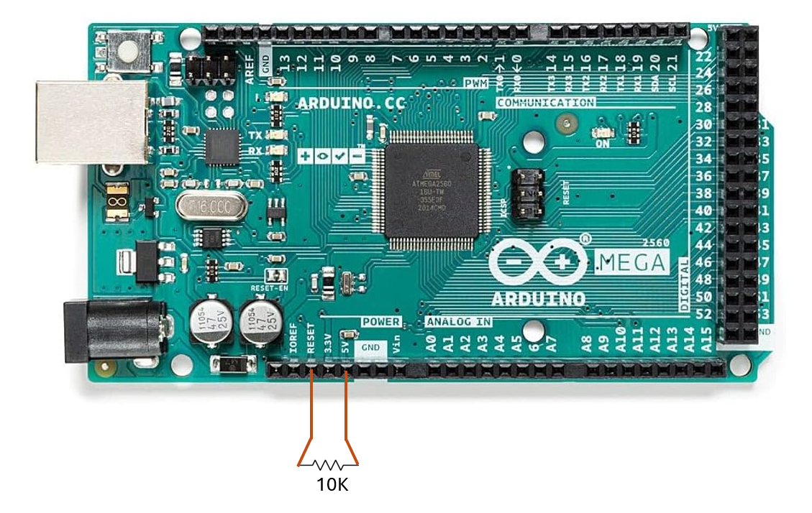
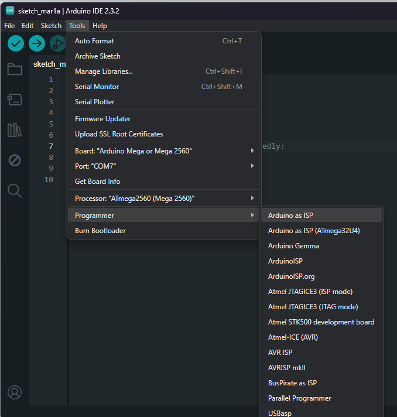
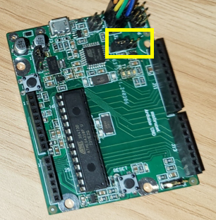
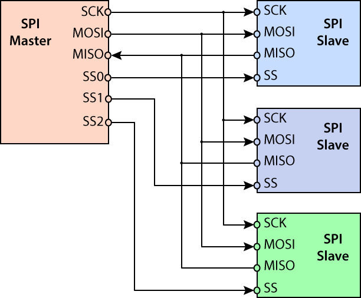
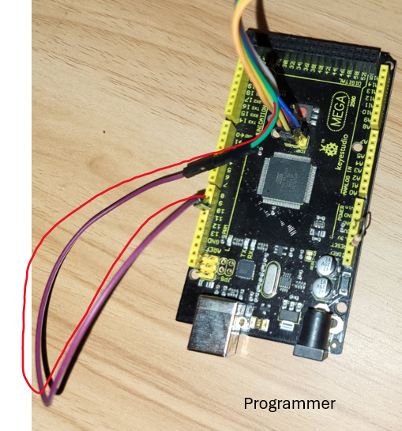
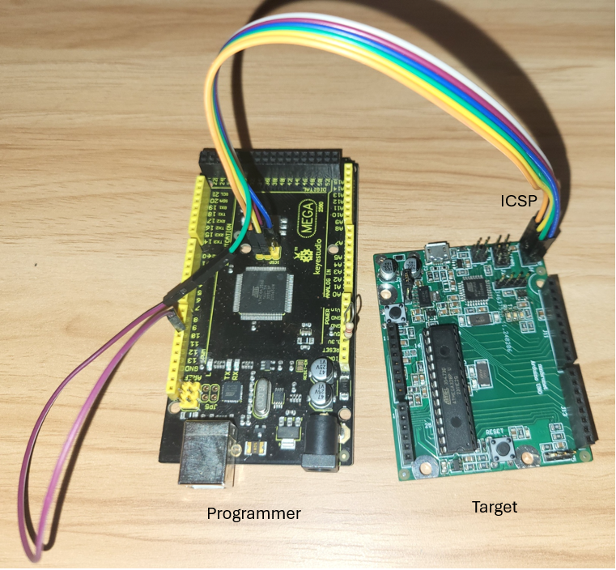
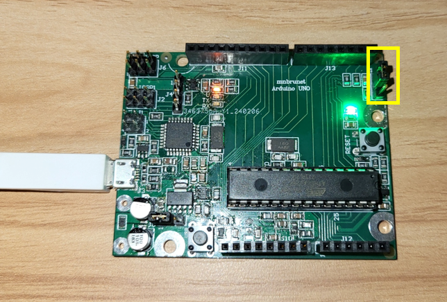

# Programming 28Pins-by-Fedevel
Repository with help for programming your own Arduino board

This repo aims to provide help to program your new Arduino board, using another working Arduino board as the ISP programmer.

## Information about the course

The board is a result of the course "Learn to Design Your Own Boards" and can be found at Udemy.

## My hardware setup

* A working Arduino MEGA 2560
* The new Arduino UNO board
* A few male-male jumper wires
* A 10k or similar resitor
* Laptop and USB cables for the boards
* Install the latest Arduino IDE on your computer


## Step by step


### 1. Configure your working Arduino board as a programmer

In my case, I was using Arduino MEGA 2560.
Connect the board to your laptop.
Open the latest version of the Arduino IDE.

1. Select your board
	
Goto Tools -> Board ->  Arduino Mega 2560
	
2. Select the correct port 
	
Now choose the correct Com port via Tools -> Serial port -> select the port used by your arduino.
	
3. Load sketch
       
Goto File -> Examples -> ArduinoISP.
        
The ArduinoISP sketch will open up and now click upload to upload the sketch to the Arduino.
	
When the sketch is fully uploaded, connect a 10K resistor or similar between pins RESET and 5V.
	


4. Select Arduino as ISP

Goto Tools -> Programmer -> Arduino as ISP
		
Don't confuse about arduino isp and arduino as isp in programmer!



References: 

* https://www.instructables.com/How-to-use-Arduino-Mega-2560-as-Arduino-isp/
* https://docs.arduino.cc/built-in-examples/arduino-isp/ArduinoISP/


### 2. Program ATmega16U2 chip

1. Prepare the connections
	
\Connect a jumper between pins 3 and 4 of the Header J4 (in my case). This connects signals 16U2_RESETn and 16U2_HDR_RESETn.



Connect the **ICSP** (for ATmega2560) header from the Programming board to the **ICSP1** of the new Arduino UNO.

Be careful to connect the pins.




On the programming board, disconnect the pin called RESET from the ICSP header, and connect it to pin number #10. In the Arduino Mega 2560, digital pin 10 is PB4 and is used for PWM. 


	
The connections should look like this


Now connect the programming Arduino board to your PC through USB.

2. Flashing the 16U2 chip

We will be using **avrdude**. Download the zip file given below, and extract the zip file to a know directory.

[Link](https://codeload.github.com/vishalsoniindia/Arduino-As-ISP-Burn-Hex-File-in-AVR-Fuse-in-AVR-Arduino-As-Programmer/zip/master)

Paste the Hex file for 16U2 in same folder where you find avrdude.exe was downloaded and extracted. 
	
For ATmega16U2 the hex file is "Arduino-usbserial-atmega16u2-Uno-Rev3.hex". 
 	
If you have problems in the future it may be because this file name is too long.

3. Commands

*Check commands.txt file in folder for a list of the commands we will be using.

Open a command prompt, and navigate to the folder where avrdude executable was extracted.

Run the following command to verify the controller name and controller code. Atmega16U2 is m16u2.

```
avrdude.exe -c arduino -b 19200 -p xyz
```

Run the following command to see some device signature and fuses ok. That means your controller is detected. Make sure to change COM7 to the COM port that your Arduino programmer is using.
```
avrdude.exe -c arduino -b 19200 -p m16u2 -P COM7 -n
```

Run the following line to set the fuses
```
avrdude.exe -c arduino -b 19200 -p m16u2 -P COM7 -U lfuse:w:0xEF:m -U hfuse:w:0xD9:m -U efuse:w:0xF4:m
```

Flash the hex file
```
avrdude.exe -c arduino -b 19200 -p m16u2 -P COM7 -U flash:w:Arduino-usbserial-atmega16u2-Uno-Rev3.hex
```

And that is it for the ATmega16U2 chip.

References:

* https://www.instructables.com/Arduino-As-ISP-Burn-Hex-File-in-AVR-Fuse-in-AVR-Ar/
* https://www.28pins.com/learning/how-to-flash-the-new-board/

### 3. Program ATmega328P chip

1. Prepare the connections
	
Remove the jumper between pins 3 and 4 of the Jumper J4 (in my case), used in the previous step. 

Connect the **ICSP** (for ATmega2560) header from the Programming board to the **ICSP** of the new Arduino UNO.

Be careful to connect the pins.

On the programming board, disconnect the pin called RESET from the ICSP header, and connect it to pin number #10. 
 
In the Arduino Mega 2560, digital pin 10 is PB4 and is used for PWM. 
	
The connections should look like this



Now connect the programming Arduino board to your PC through USB.

2. Flashing the 328P chip

We will be using **avrdude** again. Paste the Hex file for 328P chip in the same folder where you find avrdude.exe was downloaded and extracted. For ATmega328P the hex file is "optiboot_atmega328.hex". 

3. Commands

*Check the commands.txt file in the folder for a list of the commands we will be using.

Open a command prompt, and navigate to the folder where Avrdude executable was extracted.

Run the following command to verify the controller name and controller code. Atmega328P is m328p.

```
avrdude.exe -c arduino -b 19200 -p xyz
```

Run the following command to see some device signature and fuses ok. That means your controller is detected. Make sure to change COM7 to the COM port that your Arduino programmer is using.
```
avrdude.exe -c arduino -b 19200 -p m328p -P COM7 -n
```

Run the following line to set the fuses
```
avrdude.exe -c arduino -b 19200 -p m328p -P COM7 -U lfuse:w:0xFF:m -U hfuse:w:0xDE:m -U efuse:w:0xFD:m 
```

Flash the hex file
```
avrdude.exe -c arduino -b 19200 -p m328p -P COM7 -U flash:w:optiboot_atmega328.hex
```

And that is it for the ATmega328P chip.

References:

* https://www.instructables.com/Arduino-As-ISP-Burn-Hex-File-in-AVR-Fuse-in-AVR-Ar/
* https://www.28pins.com/learning/how-to-flash-the-new-board/

4. Test

To test your board, disconnect all jumpers and ICSP connections.

Place a jumper between pins 1-2 of the header J5 in my case (This connects nets 16U2PROG_328P_RESETn and 328P_AUTORESETn).



Connect your new board to your PC using a USB cable.

Check that it is detected as an Arduino device under Device Manager.

Run ArduinoIDE and download a sketch to test your board:
* Click on the "Open" icon (arrow Up) -> 01.Basics -> Blink.
* Select your board Arduino UNO
* Select COM Port: Tools -> Serial Port -> COM(select the port where the board was recognized).
* Click to "Upload" icon (arrow Right).

Your new Arduino UNO should be blinking the User LED.
